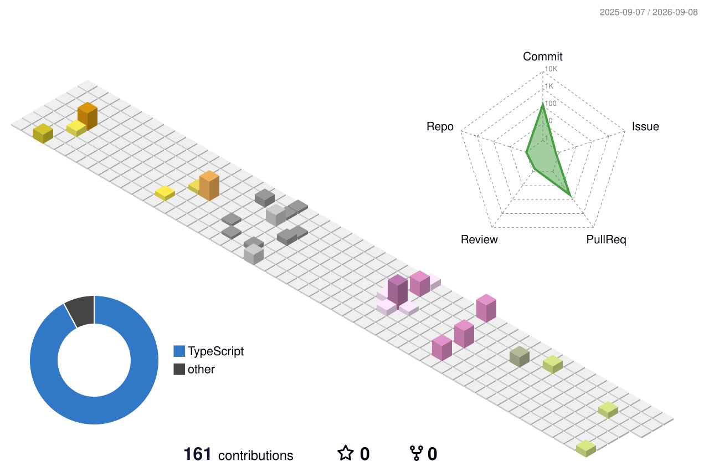

# Hi there, I'm Yutak6116 👋

## 🚀 About Me

ML Engineer / Frontend Developer.

- **Skills**: Python (TensorFlow, PyTorch), TypeScript (React, Vue.js)
- **Hobbies**: Golf (Best 77), Poker (BigFish, Tourney wins)

## 📊 GitHub Stats

  
  

## 🛠 Projects

### Portfolio

My personal portfolio site built with React & TypeScript.

 

### Poker Totalization System

A balance management app for my poker circle.

 

### Kake-AI-bo

My household budget app packed with my “wants”.

 

## 📫 Connect with Me

