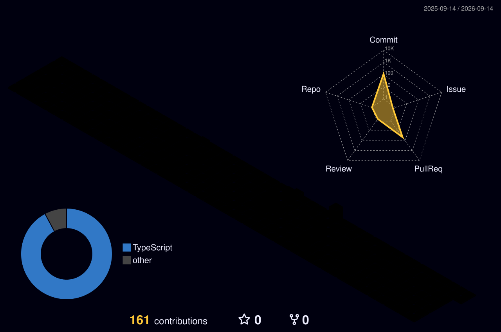

# Hi there, I'm Yutak6116 👋

## 🚀 About Me

ML Engineer / Frontend Developer.

- **Skills**: Python (TensorFlow, PyTorch), TypeScript (React, Vue.js)
- **Hobbies**: Golf (Best 77), Poker (BigFish, Tourney wins)

## 📊 GitHub Stats

  
  

## 🛠 Projects

### [Portfolio](https://yutak6116.github.io/Portfolio/)

My personal portfolio site built with React & TypeScript.

### [Poker Totalization System](https://poker-totalization-system.com/)

A balance management app for my poker circle.

## 📫 Connect with Me

